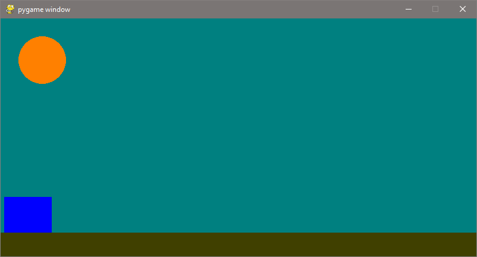
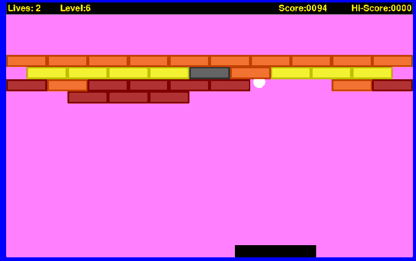
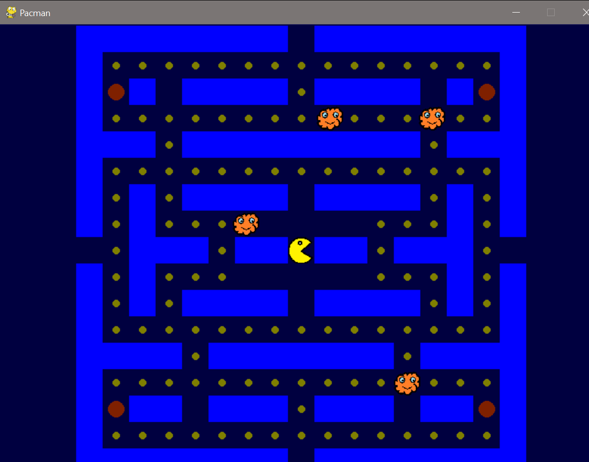
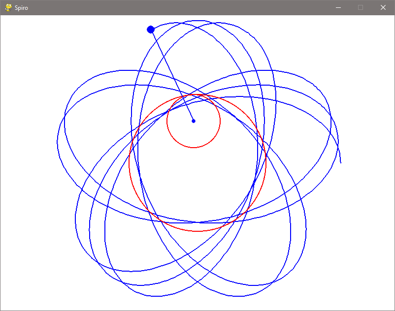
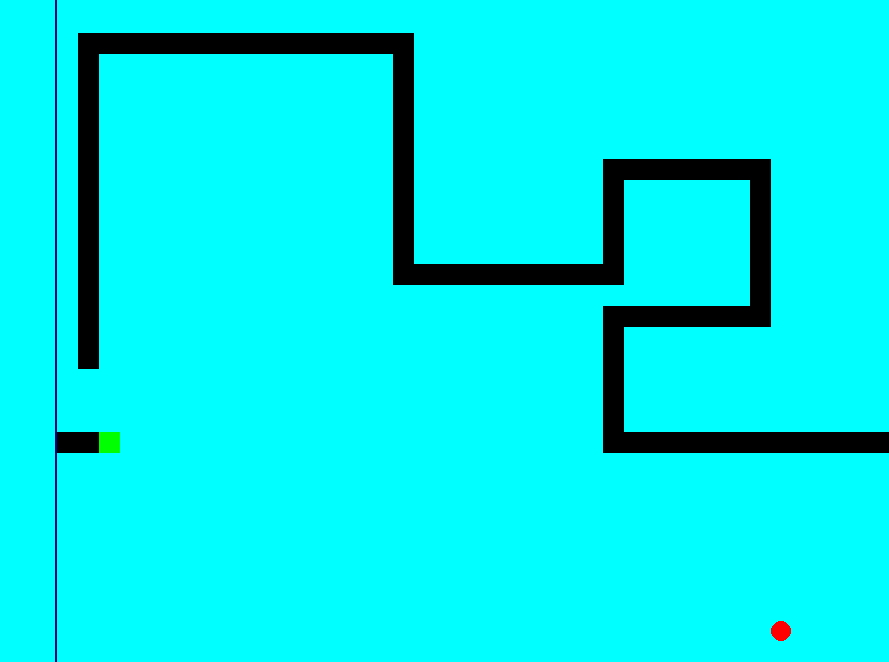
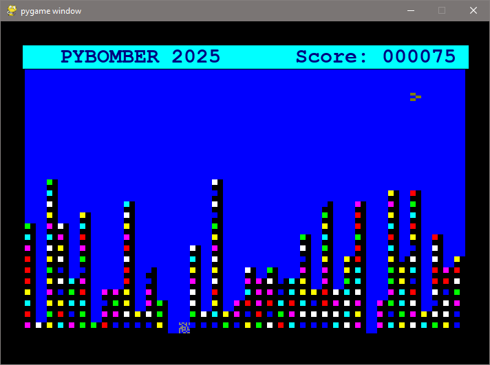
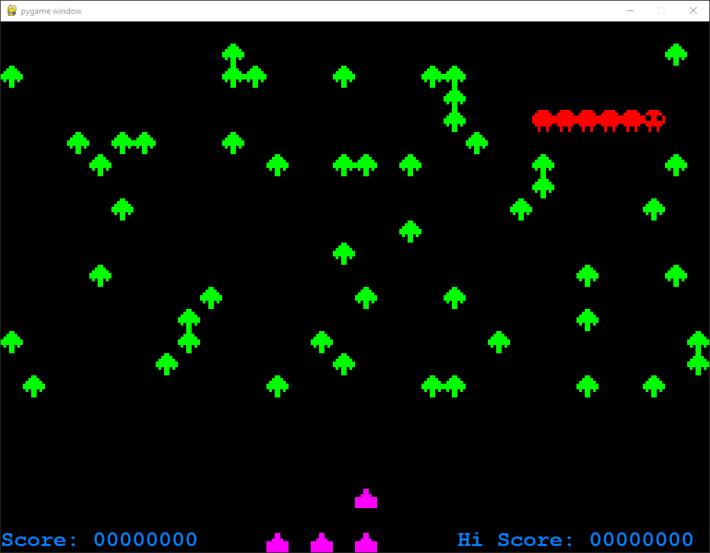

# Pygame by Example

Writing classic games as a demonstration of pygame

## Introduction

This is a list of classic games written using the pyththon game library PyGame

- Jump
- Breakout
- Pacman [Tutoriel en Français](pacman/tutoriel/Introduction.md)
- Snake
- Spiro
- Bomber
- Memory (still to be written)
- Minesweeper (still to be written)
- Moon buggy (still to be written)
- Space Invaders (still to be written)
- Falling Blocks (still to be written)
- Jump man (still to be written)

## Jump

## Breakout

## [Pacman](PacMan/pacman.md)

[Tutoriel en Français ](pacman/turoriel/pacmanIntro.md)

## [Spiro](spiro/spiro.md)

## [snake](snake/snake.md)

## [Bomber]()

## [Centipede]()

